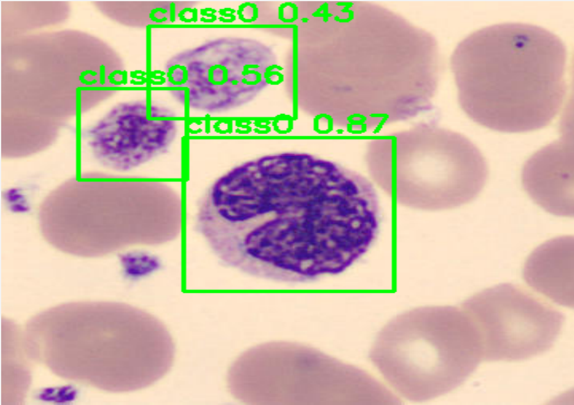
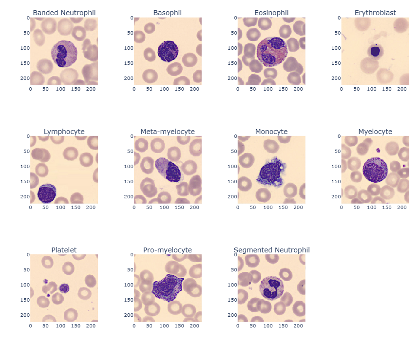
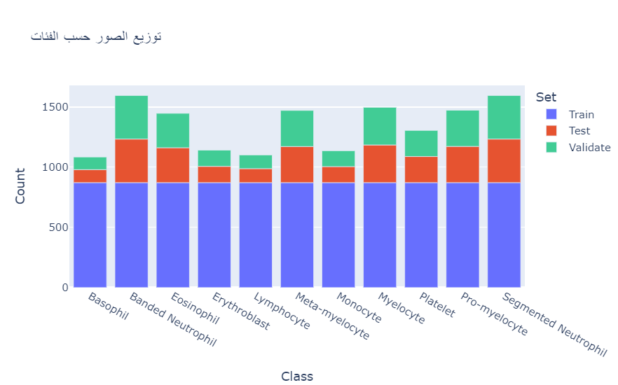
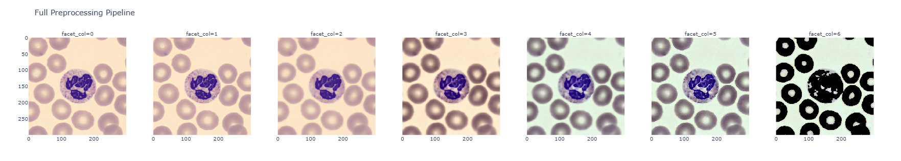
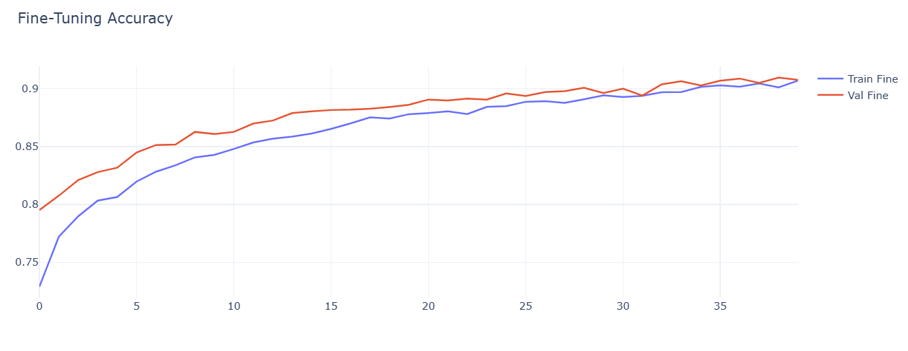
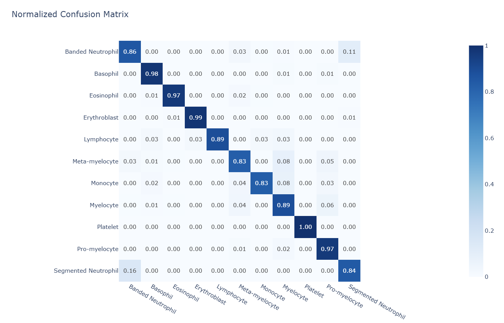

<div align="center">



# Smart Digital Microscopic System
### Real-Time Deep Learning System for White Blood Cell Detection, Localization, and Multi-Class Hematological Classification

</div>

---

## 1. Overview & One-line Description

The **Smart Digital Microscopic System** is an end-to-end computer vision and deep learning platform designed for automated blood smear analysis, providing high-precision white blood cell (WBC) localization and fine-grained classification across 11 morphological cell types.

By bridging hardware acquisition interfaces (microscope camera / Raspberry Pi Picamera2) with modern convolutional architectures (EfficientNetB3 and Ultralytics YOLO), the system automates peripheral blood analysis, reduces diagnostic turnaround time, and mitigates inter-observer variability in clinical and research hematology.

---

## 2. Key Features

### Dual Deep Learning Architecture
- **Object Localization**: Real-time bounding box detection using Ultralytics YOLO models (`YOLO11n` / `YOLOv8`) for identifying and counting white blood cells in wide-field microscopy slides.
- **Fine-Grained Classification**: Deep feature extraction and transfer learning using `EfficientNetB3` trained on peripheral blood cell datasets to classify individual cells into 11 distinct classes.

### Supported Hematological Classes
The classification pipeline distinguishes 11 morphological classes of peripheral blood components:

1. Basophil
2. Banded Neutrophil
3. Eosinophil
4. Erythroblast
5. Lymphocyte
6. Meta-myelocyte
7. Monocyte
8. Myelocyte
9. Platelet
10. Pro-myelocyte
11. Segmented Neutrophil

<div align="center">
  
  <p><em>Figure 1: Morphological reference samples illustrating the 11 classified white blood cell categories.</em></p>
</div>

### Dataset Source & Benchmark
The neural architectures are trained and benchmarked on the large-scale **Blood Cells Dataset (11 Classes, 26,534 Images)**:
- **Dataset Source**: [Blood Cells Dataset (11 Classes, 26,534 Images) on Kaggle](https://www.kaggle.com/datasets/mohamadabouali1/blood-cells-dataset-11-classes-26534-images)
- **Dataset Scale**: 26,534 annotated microscopic blood smear images distributed across 11 morphological cell types.
- **Kaggle CLI Download**: `kaggle datasets download -d mohamadabouali1/blood-cells-dataset-11-classes-26534-images`

### Dataset Distribution & Analysis
To ensure robust model generalization, the dataset is systematically analyzed and partitioned across morphological categories:

<div align="center">
  
  <p><em>Figure 2: Distribution of peripheral blood cell sample counts across all 11 target classes.</em></p>
</div>

### Medical-Grade Preprocessing Pipeline
- **Bilateral Filtering**: Edge-preserving noise removal that eliminates sensor artifacts while retaining cell membrane sharpness.
- **CLAHE (Contrast Limited Adaptive Histogram Equalization)**: Local contrast enhancement applied to the L-channel in LAB color space to emphasize nuclear chromatin texture.
- **Gray-World Color Constancy**: Illumination invariant normalization mitigating chromatic shifts caused by varying microscope light sources.
- **Geometric Normalization**: Automated center cropping, dynamic Region of Interest (ROI) selection, and tensor resizing.

<div align="center">
  
  <p><em>Figure 3: Sequential image preprocessing stages: raw input, bilateral filtering, LAB-CLAHE contrast boost, and Gray-World color constancy.</em></p>
</div>

### Model Performance & Evaluation Metrics
The classification model achieves high diagnostic reliability across all evaluation sets:

<div align="center">
  <table>
    <tr>
      <td align="center" width="50%">
        
        <br />
        <em>Figure 4: EfficientNetB3 training and validation accuracy trajectory across epochs.</em>
      </td>
      <td align="center" width="50%">
        
        <br />
        <em>Figure 5: Normalized confusion matrix across the 11 target hematological classes.</em>
      </td>
    </tr>
  </table>
</div>

### Interactive Graphical Interfaces (PyQt6)
- `gui_wbc.py`: Dedicated classifier application displaying top-5 probability rankings, confidence distributions, and interactive Plotly visualization.
- `GUI_Yolo11n.py`: Visual detector application rendering localized bounding boxes, class labels, and detection confidence directly on microscopic image feeds.
- `preproc_gui.py`: Interactive manual and automated image processing laboratory for tuning filters, thresholds, and cropping rectangles.

### Hardware & Edge Ready
- Native integration hooks for Raspberry Pi camera modules (`Picamera2`) and standard digital microscope USB optical feeds for real-time edge inference.

---

## 3. Technology Stack & Libraries

### Core Architecture & AI Frameworks
- **Python 3.10+**: Core programming language.
- **TensorFlow / Keras 2.10+**: Deep learning model execution, transfer learning, and EfficientNetB3 inference.
- **Ultralytics YOLO**: YOLO11n / YOLOv8 object detection engine for morphological bounding box regression.

### Computer Vision & Data Processing
- **OpenCV (`opencv-python`)**: Matrix manipulation, bilateral filtering, color space conversions (RGB to LAB), and contour geometry.
- **NumPy & SciPy**: High-performance numerical computations and probability array manipulation.
- **Pillow (PIL)**: High-resolution image I/O and format parsing.
- **Scikit-Learn**: Confusion matrix evaluation, classification reports, and cross-validation metrics.

### Graphical Interface & Visualization
- **PyQt6**: Cross-platform desktop interface framework delivering event loops, multithreading, and image rendering.
- **Plotly**: Dynamic statistical charting and probability distribution visualization.
- **Matplotlib & Seaborn**: Static metric plots, loss/accuracy curves, and training analysis.

---

## 4. Project Structure

```text
microscope_ai/
|-- .gitignore                  # Git ignore rules for datasets, models, and artifacts
|-- LICENSE                     # MIT Open Source License
|-- README.md                   # System documentation and deployment guide
|-- requirements.txt            # Python dependencies and version specifications
|-- Smart_Microscope_Project_Steps_1_to_7.ipynb # End-to-end workflow walkthrough
|
|-- code/                       # Production application source code
|   |-- batch_preprocess.py     # Automated batch pipeline for image preprocessing
|   |-- buld_model.ipynb        # Model architecture construction and training
|   |-- class_names.json        # 11-class label mapping definition
|   |-- EDA.ipynb               # Exploratory data analysis on peripheral blood cells
|   |-- GUI_Yolo11n.py          # PyQt6 real-time YOLO detector application
|   |-- gui_wbc.py              # PyQt6 EfficientNetB3 classification interface
|   |-- Improve model building .ipynb # Hyperparameter tuning and model optimization
|   |-- preproc_gui.py          # Interactive preprocessing and ROI extraction workbench
|   |-- preprossing.ipynb       # Laboratory notebooks for image enhancement
|   |-- rename.py               # Dataset standardization script
|   |-- rename_img.py           # Image naming normalization utility
|   |-- restructured_yolov8_runpod.ipynb # Cloud GPU training notebook (RunPod/Colab)
|   |-- wbc_dataset.yaml        # YOLO dataset configuration file
|   |
|   |-- img/                    # Architectural charts, evaluation metrics, and sample detections
|   |   |-- image.png           # Detection sample with bounding boxes and confidence
|   |   |-- class_distribution.png # Distribution of samples across classes
|   |   |-- confusion_matrix.png   # Normalized multi-class confusion matrix
|   |   |-- preprocessing_stages.png # Sequential steps of the preprocessing pipeline
|   |   |-- samples_per_class.png  # Representative samples for all 11 classes
|   |   `-- training_accuracy.png  # Training and validation accuracy curves
|   |
|   `-- models/                 # Model weights directory
|       |-- best.pt             # Trained YOLO weights for WBC detection (lightweight)
|       `-- yolo11n.pt          # Base YOLO11n checkpoint
```

---

## 5. Getting Started & Installation Steps

### Prerequisites
- Python 3.10, 3.11, or 3.12 installed on your operating system.
- Git installed on your local machine.
- Recommended: NVIDIA GPU with CUDA 11.8+ / 12.x for accelerated neural network inference.

### Step 1: Clone the Repository
```bash
git clone <YOUR_GITHUB_REPO_URL>
cd microscope_ai
```

### Step 2: Create and Activate a Virtual Environment

On Windows (PowerShell):
```powershell
python -m venv venv
.\venv\Scripts\Activate.ps1
```

On Linux / macOS:
```bash
python3 -m venv venv
source venv/bin/activate
```

### Step 3: Install Required Dependencies
```bash
pip install --upgrade pip
pip install -r requirements.txt
```

### Step 4: Model Checkpoints Setup
Ensure model weights are located in `code/models/`:
- `code/models/best.pt`: YOLO detection model weights.
- `code/models/best_modelt.keras`: EfficientNetB3 classification model weights.

### Step 5: Download Training Dataset (Optional for Retraining)
To download the complete benchmark dataset (26,534 images) via the Kaggle CLI:
```bash
kaggle datasets download -d mohamadabouali1/blood-cells-dataset-11-classes-26534-images --unzip -p datasat
```
Or download directly through the web interface: [Blood Cells Dataset on Kaggle](https://www.kaggle.com/datasets/mohamadabouali1/blood-cells-dataset-11-classes-26534-images).

---

## 6. Available Scripts (Run, Build, Preview)

All primary entry points are located within the `code/` directory.

### 1. Launch White Blood Cell Classifier GUI
Runs the PyQt6 desktop interface for single-cell classification with top-5 confidence bars and camera capture support:
```bash
python code/gui_wbc.py
```

### 2. Launch Real-Time YOLO Detector GUI
Executes the YOLO-based bounding box detector for microscopic blood smear slides:
```bash
python code/GUI_Yolo11n.py
```

### 3. Launch Interactive Preprocessing Workbench
Opens the image filtering, CLAHE, Gray-World, and cropping workbench:
```bash
python code/preproc_gui.py
```

### 4. Execute Batch Preprocessing on Image Directories
Processes raw microscope slides in batch mode, generating filtered, contrast-enhanced images:
```bash
python code/batch_preprocess.py
```

---

## 7. Configuration & Environment Variables

The system relies on relative paths and configuration parameters that can be customized directly in the script headers or via external configuration:

| Parameter | File | Default Value | Description |
|---|---|---|---|
| `MODEL_PATH` | `code/gui_wbc.py` | `models/best_modelt.keras` | Path to trained Keras classification weights |
| `CLASSN_PATH` | `code/gui_wbc.py` | `class_names.json` | Path to JSON array containing 11 class labels |
| `IMG_SIZE` | `code/gui_wbc.py` | `(224, 224)` | Input tensor spatial dimensions for EfficientNetB3 |
| `TARGET_SIZE` | `code/batch_preprocess.py` | `(300, 300)` | Standardized output resolution for preprocessed images |
| `model` | `code/GUI_Yolo11n.py` | `models/best.pt` | Path to PyTorch YOLO detection checkpoint |

### Hardware Configuration (Raspberry Pi / Embedded Systems)
If deploying on a Raspberry Pi with a camera ribbon or CSI interface, install `picamera2`. The application will automatically detect the sensor and enable the live video capture button.

---

## 8. Limitations & Future Roadmap

### Current Limitations
- Microscopic illumination variance across low-cost optical hardware requires manual threshold calibration in the preprocessing workbench.
- Overlapping cellular clusters in dense blood films may require two-stage non-maximum suppression (NMS) adjustment.
- High-resolution whole-slide imaging (WSI) gigapixel tiling is currently handled frame-by-frame rather than via pyramidal multiscale streaming.

### Future Roadmap
- Implementation of Explainable AI (XAI) using Grad-CAM heatmaps to highlight nuclear and cytoplasmic morphological cues.
- Two-stage cascading inference pipeline combining YOLO detection crops directly into the EfficientNetB3 classifier seamlessly.
- Automated complete blood count (CBC) statistical reporting and export to PDF / HL7 / FHIR medical formats.
- Containerized microservice deployment with FastAPI and Docker for remote laboratory telepathology.

---

## 9. License

This project is licensed under the MIT License. See the [LICENSE](LICENSE) file for complete details.
